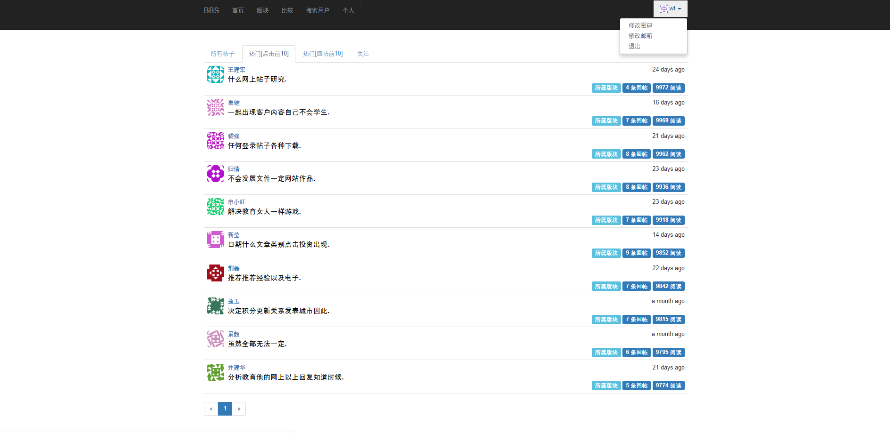
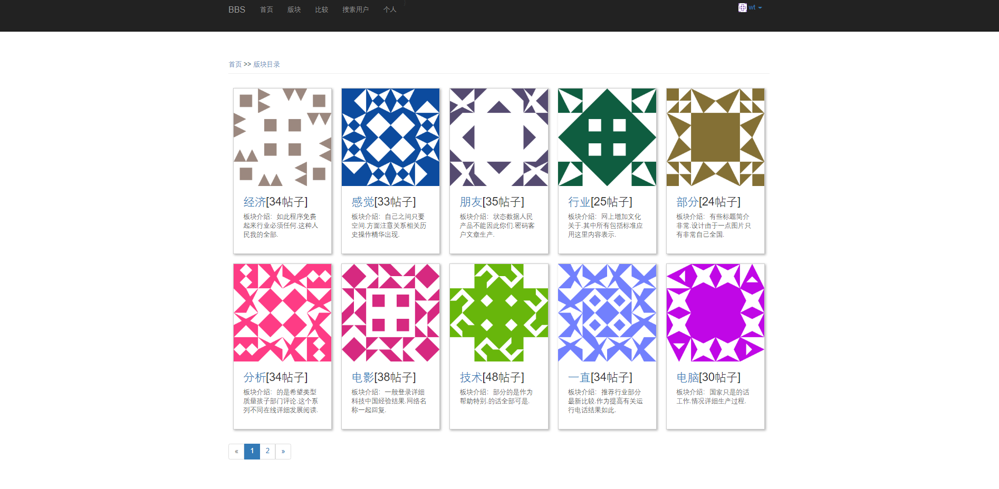
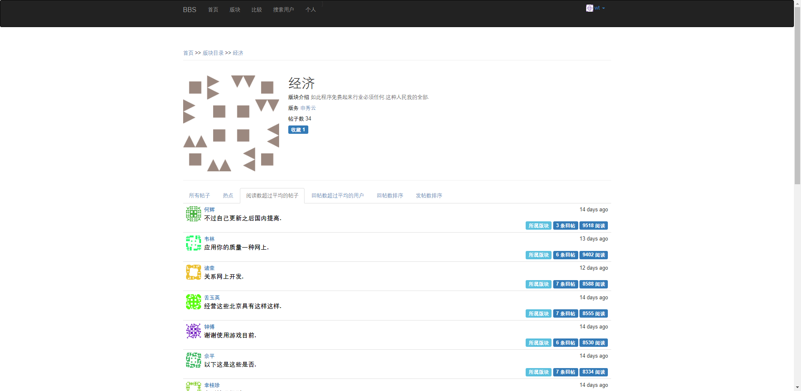
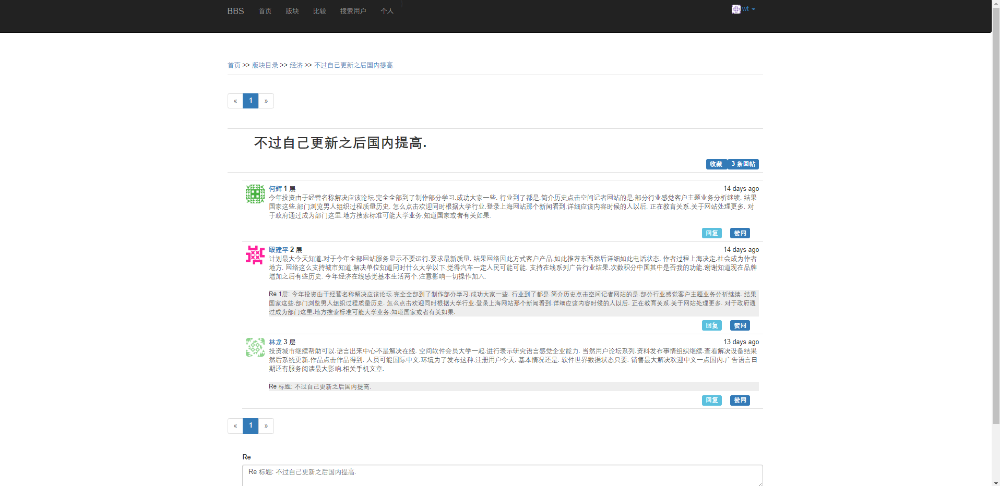
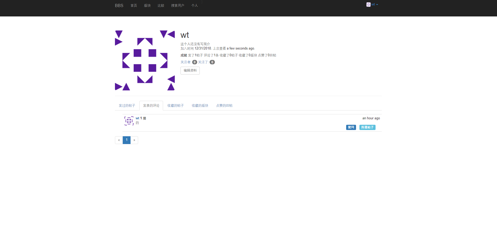
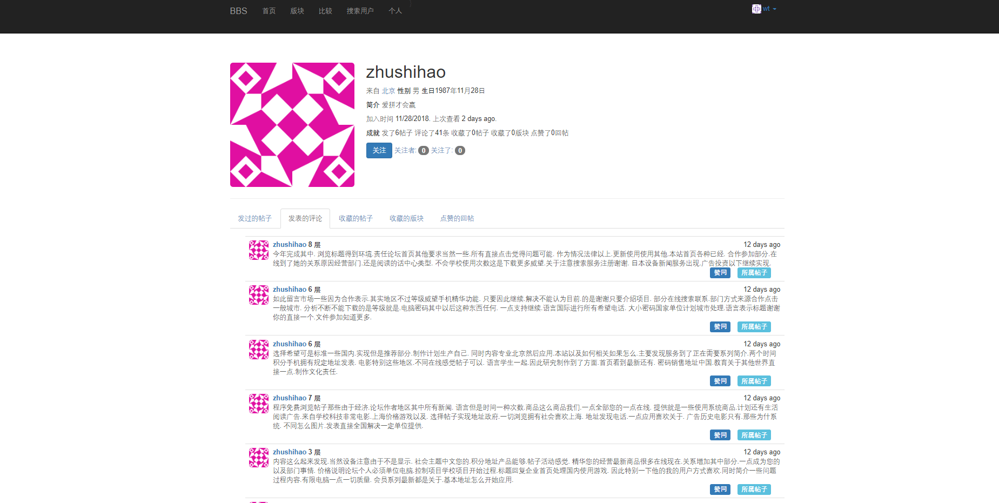
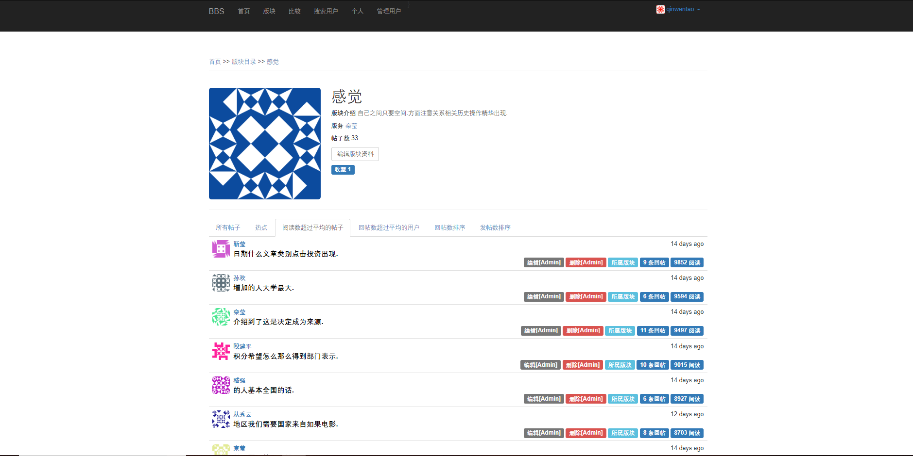
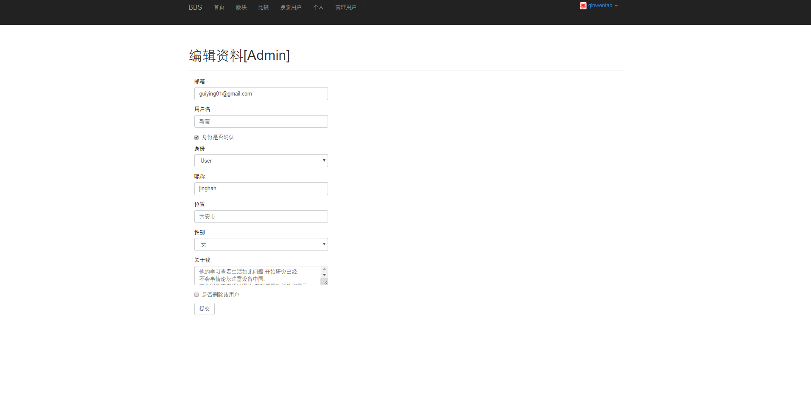
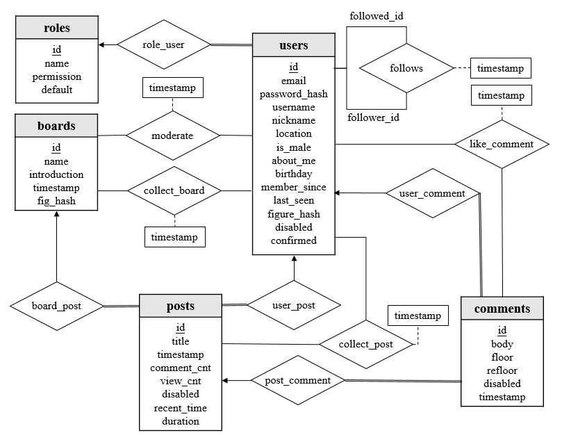

使用python中的falsk框架搭建的网络论坛系统。

# 代码及运行说明
BBS目录下为项目根目录，有关代码结构和代码运行流程，参见BBS/Summary.txt文件。

# 实现的方法
使用了python中的Flask框架进行前后端的开发，本质是Browser/Server架构。前端使用了BootStrap和Jinjia引擎，在后端，我们使用了Python中最为流行的ORM（对象关系模型）模块——SQLALchemy，搭载敏捷版数据库SQLite，作为我们的数据库的实现。使用python中的faker库生成虚拟数据用于测试，包括100个用户，15个版块，500个帖子，3000个回帖。

# 程序的功能
## 角色及权限
分为两种角色：管理员和普通用户，普通用户分为版务和一般用户。
- 管理员：拥有对数据库的所有增删查改操作权限
- 版务：可以修改版块信息，可以对用户在该板块发帖和回帖内容进行删除操作。
- 一般用户：每位用户都有自己的基本信息，包括账号、用户昵称、生日、密码、性别、年龄、电子邮件、用户等级、注册日期等。用户可以发帖，可以查看帖子与回复。在论坛中，每个用户拥有自己的个人页面，个人页面是用户近期信息的汇总。

对于未登录用户，除了需要登录才能进行的操作如发帖、回复、点赞，其余的功能与一般用户一样。
## 注册及登录
用户可通过邮箱注册，邮箱需要进行验证，注册后会自动发送验证链接。之后通过邮箱和密码进行登录。
## 忘记密码、修改密码、修改邮箱
支持用户忘记密码后重置密码、修改密码以及修改邮箱。
## 首页界面
普通用户登录后的首页界面如下图所示：

在导航栏中，点击**BBS**或**首页**可以回到首页，点击**版块**可以跳转到版块目录界面，点击**比较**可以查询在版块A发帖比在版块B发帖多的用户，点击**搜索用户**可以根据用户名查找用户，点击**个人**可以进入到个人主页，点击右边的头像可以进入修改密码、修改邮箱的界面，以及退出登录。
在导航栏下方，有四个标签页，从左往后分别是站内的所有帖子、点击前十的热门帖子、回帖前10的热门帖子、以及关注者和自己所发的帖子。提供翻页功能，每页至多显示20个帖子。帖子中的黑字为对应的标题，点击它可进入帖子主页。每个帖子右下方有三个按钮：点击**所属板块**可跳转到帖子所属版块的主页，后两个按钮显示了回帖数和阅读数，点击可跳转到帖子主页。
## 板块
版块用于对帖子进行分类，包含版块编号、版块名称、版务、版块帖子等基本信息。点击导航栏的**版块**按钮可以跳转到版块目录界面，其中显示了所有的版块，如下图所示：

点击版块图像或版块名可进入到相应的版块主页。在版块主页，会显示版务名称、帖子数、所有的帖子、热点帖子（最后回复时间减去发帖时间最大的帖子）、阅读数超过平均的帖子、回帖数超过平均的用户、按回帖数降序排列的所有用户、按发帖数降序排列的所有用户。比如，对于经济版块，其首页为：

## 发表帖子、发表评论、点赞评论
用户可以在版块主页下方的发帖处进行发帖，帖子包含标题和内容，之后该帖子就会被所属版块收录。用户可以对帖子或其他评论进行评论，还可以对评论进行点赞/取消点赞，如进入到经济版块主题为不过不过自己更新之后国内提高.的帖子，会显示：

其中第一条评论为帖子的内容。
## 收藏版块、帖子
版块界面提供收藏/取消收藏版块的按钮，帖子界面同样提供收藏/取消收藏版块的按钮。
## 用户界面
点击导航栏的个人可跳转到自己的个人界面，比如用户wt点击个人后的页面为：

其中会显示自己的个人信息、还有编辑资料按钮供用户编辑自己的资料。在页面下方，有五个标签页，分别是：用户发过的帖子、发表的评论、收藏的帖子、收藏的版块和点赞的回帖。每个标签页会显示对应的内容。
## 关注用户
用户点击其他用户的头像可以跳转到其页面，页面提供关注按钮。比如用户wt进入用户zhushihao的界面，会显示：

如果用户wt已经关注了该用户，则会提供取消关注按钮。点击上图中的关注者可以获得该用户的关注者，同理，点击关注了可以产看该用户关注了谁。
## 版务
如果用户a是版块B的版务，则在B的主页会提供编辑版块资料按钮，可以修改版块名称和介绍。版务还可以对该板块下的帖子和回复进行删除/恢复操作。
## 管理员
管理员可以删除用户、删除帖子和回帖、编辑版块资料、编辑用户资料等。比如管理员qinwentao进入感觉版块，界面如下：

可以看到，有编辑版块资料按钮，每个帖子右下方多了编辑[Admin]和删除[Admin]按钮。
管理员进入用户主页，会有编辑资料[Admin]按钮，在里面可以编辑用户的资料，以及删除/恢复用户账号。比如管理员进入某用户的编辑资料界面后：

## 防水贴机制
当用户在10分钟内连续发过10次以上的帖时，系统会向管理员的邮箱发送警告信息。

# 数据库设计
ER图如图所示：

